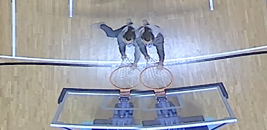
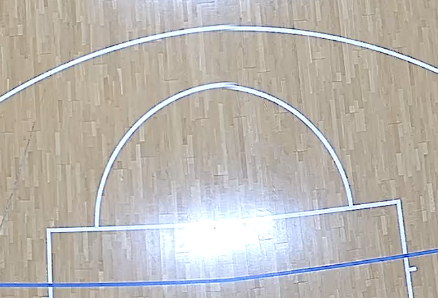
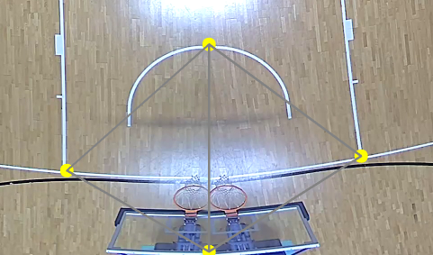

# Multi-sensor camera dewarping for basketball court view correction

This tool has been developed to fix visual artifacts such as objects duplication and not converging lines created by a system of three multi-sensor cameras in charge of recording basketball matches.

|<br>Object duplication|<br>Line not convering to the same point|
|:-:|:-:|

PUT VIDEO HERE!

## Install and Run
### Requirements
- [Poetry](https://python-poetry.org/docs/basic-usage/) as package manager.
- [Python 3.10/3.11](https://www.python.org) 
- [Git LFS](https://docs.github.com/en/repositories/working-with-files/managing-large-files/installing-git-large-file-storage) to store and download the video/assets used

### Installation
0. Install manually the requirements
1. Clone the repo
```
git clone https://github.com/cannox227/camera-dewarping
```
2. Access the folder
```
cd camera-dewarping
```
3. Download assets (optional)
```
git lfs pull
```
4. Install required packages using poetry
```
poetry install
```
5. Activate Poetry shell
```
poetry shell
```
6. Run the script
- **Option 1:** run the script for the first time on a specific video source (to define the transformation)
  ```
  dewarp <filename>
  ```
- **Option 2:** run the script using a previously stored transformation matrix  (directly picked up from the output folder)
  ```
  dewarp <file-name> --load 
  ```
### Run the tool
Here below are reported all the possible flags and keybinding that can be used in the tool
```
Usage: dewarp [OPTIONS] FILE

  Dewarping tool for cameras
  Keybindings:
      - q: exit                               - s: save configuration
      - c: cancel selected point              - r: release point selection (deselect)
      - p: pop the last point                 - l: load saved data
      - g: create a new group of points       - v: toggle visibility of the warped area
      - Enter: advance to the next state      - d: toggle drawing of points and triangles

Options:
  --load         Load presaved config (from output folder)
  --scale FLOAT  Window scale wrt. video size
  --help         Show this message and exit.
```

#### Triangle definition and warping
When interacting with the video source it is possible to define three or more points from which one or more triangle will be defined using the [Delaunay trianglulation](https://en.wikipedia.org/wiki/Delaunay_triangulation) technique. 
After having defined the triangles (with blue lines), by pressing `Enter` key we can start moving the triangles to the new positions.
In this phase we can move the triangleses (with gray lines), then when we are happy with the configuration we can press again `Enter` and effectively apply the warping.

|<br>Triangle definition|<br>Triangle can be moved to new position|
|:-:|:-:|

|<br>New position selected|<br>Warping applied|
|:-:|:-:|

!VIDEO 1 HERE

#### Handling different groups of triangles
Considering the fact that Delaunay triangulation returns a group of triangles that share the same points (some of which are indeed common vertices) and artifacts don't always occur in nearby areas of the court, it's necessary to ensure the user can define more than one group of triangles.

By pressing the g key, it's possible to define additional groups of triangles, thus applying more than one Delaunay triangulation completely independently.

!VIDEO 2 HERE
#### Erasing a specific point / Erasing the last added point
Another proposed feature involves deleting a specific point by selecting it and pressing the `c` key (cancel), or deleting the last added point with the `p` key (pop).

!VIDEO 3 HERE

#### Saving the transformation
After having defined the new triangles and having applied the warping, it is possible to store the information regarding each group of old and new triangles and the correspective transformation matrix. This can be achieved by pressing the key `s`. The files are stored as Numpy array in the `output` folder in `.npy` [format](https://numpy.org/devdocs/reference/generated/numpy.lib.format.html)
